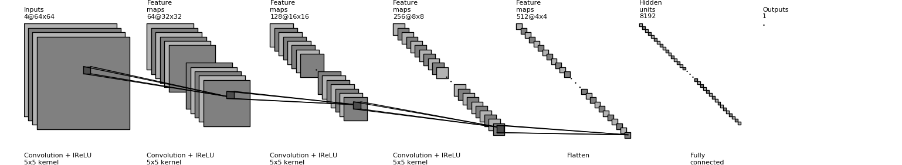
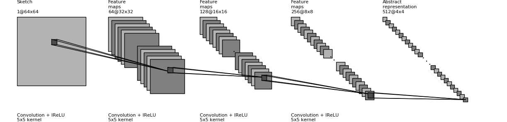
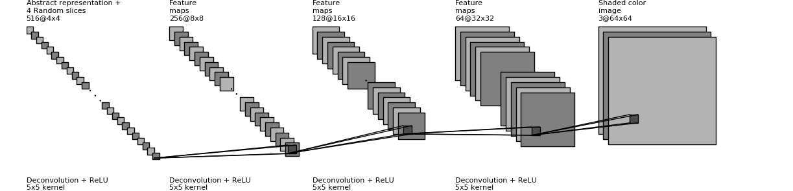
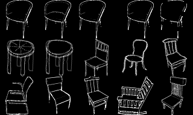
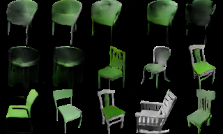
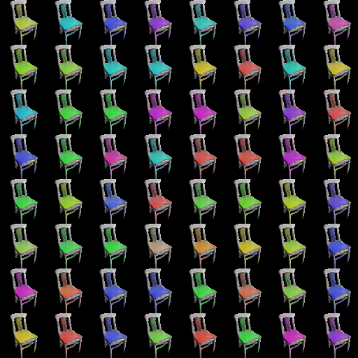

CDCGAN for sketch based image synthesis in Tensorflow
====================

A network architecture to train a neuronal network to generate images from a
guidance image, e. g. a human made sketch.
Ambiguties left open from the sketch, such as hue and saturation, are defined through random parameters supplied.
The approach builds on top of DCGANs as proposed by Radford et al. in their work 
[Deep Convolutional Generative Adversarial Networks](https://arxiv.org/abs/1511.06434).

Architecture of the discriminator
---------------------------------

Architecture of the generator
-----------------------------

Prerequisites
-------------

- Python 2.7 or Python 3.3+
- [Tensorflow](https://www.tensorflow.org/)
- [SciPy](http://www.scipy.org/install.html)

Results
-------

Several sketches using all the same random parameters.

Same sketch using different random parameters.

